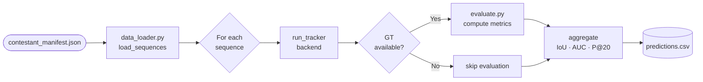
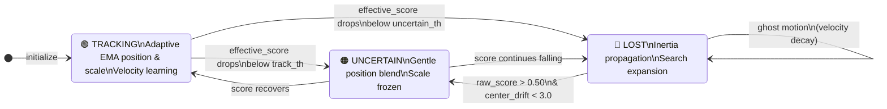

# 🛸 AeroVision AI

> **Aerial single-object tracking pipeline built for the AIC-4 competition.**  
> Supports multiple deep and classical tracker backends, real-time visualization, adaptive state-machine logic, and automatic CSV export.


---

## 📑 Table of Contents

1. [Overview](#overview)
2. [Pipeline](#pipeline)
3. [Tracker Backends](#tracker-backends)
4. [State Machine (OSTrack)](#state-machine-ostrack)
5. [Project Structure](#project-structure)
6. [Data Contract](#data-contract)
7. [Installation](#installation)
8. [Run](#run)
9. [Visualization](#visualization)
10. [Evaluation Metrics](#evaluation-metrics)
11. [Output CSV](#output-csv)
12. [Keyboard Controls](#keyboard-controls)
13. [Known Limitations](#known-limitations)

---

## Overview

AeroVision AI is a **manifest-driven** object-tracking pipeline for UAV/aerial video datasets. It:

- Loads sequences from `data/metadata/contestant_manifest.json`
- Runs any of **five interchangeable tracker backends** per sequence
- Overlays predictions and ground-truth boxes in real time
- Computes per-sequence tracking metrics (IoU, AUC, Precision, Robustness)
- Exports all frame-level predictions to `outputs/predictions.csv`

---

## Pipeline



---

## Tracker Backends

Five tracker backends are available. Switch between them by uncommenting the relevant import in `main.py`:

| Backend | File | Model | Device | Notes |
|---------|------|-------|--------|-------|
| **CSRT** (classical) | `src/tracker.py` | OpenCV CSRT | CPU | Lightweight, no GPU needed |
| **SiamRPN** | `src/siam_tracker.py` | SiamRPN | GPU / CPU | Optical-flow freeze fallback |
| **TCTrack** | `src/tctrack_tracker.py` | TCTrack (AlexNet) | GPU / CPU | UAV-kinematics relaxed penalties |
| **TCTrack++** | `src/tctrack_plusplus_tracker.py` | TCTrack++ | GPU / CPU | TemporalState class, no-display mode |
| **OSTrack** ✅ *(active)* | `src/ostrack_tracker.py` | ViT-Base MAE | GPU / CPU | Full state-machine, best accuracy |

To switch tracker, edit `main.py`:

```python
# Uncomment exactly ONE of these:
# from src.tracker                  import run_tracker   # CSRT
# from src.siam_tracker             import run_tracker   # SiamRPN
# from src.tctrack_tracker          import run_tracker   # TCTrack
# from src.tctrack_plusplus_tracker import run_tracker   # TCTrack++
from src.ostrack_tracker          import run_tracker   # OSTrack (default)
```

---

## State Machine (OSTrack)

OSTrack (`src/ostrack_tracker.py`) uses a three-state machine to handle occlusion, drift, and re-localization:



**Score pipeline within each frame:**

```
raw_score
   ↓ temporal smoothing (5-frame window)
stable_score
   ↓ EMA decay
smooth_score
   ↓ min(stable, smooth)
effective_score
   ↓ penalty system (jump · drift · direction · area)
final effective_score  →  state decision
```

---

## Project Structure

```
aerovision_ai/
├── main.py                          # Entry point
├── requirements.txt
├── models/
│   ├── OSTrack_ep0300.pth.tar       # OSTrack ViT-Base weights
│   ├── siamrpn.pth                  # SiamRPN weights
│   ├── config.yaml                  # SiamRPN config
│   ├── tctrack.pth                  # TCTrack weights
│   └── tctrack++.pth                # TCTrack++ weights
├── OSTrack/                         # OSTrack submodule
├── tctrack/                         # TCTrack / TCTrack++ submodule
├── pysot/                           # PySOT (SiamRPN) submodule
├── src/
│   ├── data_loader.py               # Manifest parser, sequence builder
│   ├── tracker.py                   # CSRT tracker loop + visualization
│   ├── siam_tracker.py              # SiamRPN tracker loop
│   ├── tctrack_tracker.py           # TCTrack tracker loop
│   ├── tctrack_plusplus_tracker.py  # TCTrack++ with TemporalState
│   ├── ostrack_tracker.py           # OSTrack state-machine engine (active)
│   ├── evaluate.py                  # Per-sequence metric evaluation
│   ├── inference.py                 # Ground-truth visualization utility
│   └── utils/
│       └── metrics.py               # IoU, center dist, AUC, robustness
├── data/
│   ├── metadata/
│   │   └── contestant_manifest.json # Dataset registry
│   └── <sequences>/                 # Videos + annotation files
└── outputs/
    └── predictions.csv              # Generated tracking results
```

---

## Data Contract

### Manifest (`data/metadata/contestant_manifest.json`)

```json
{
  "train": {
    "seq_001": {
      "video_path": "sequences/seq_001/video.mp4",
      "annotation_path": "sequences/seq_001/groundtruth.txt"
    }
  },
  "public_lb": {
    "seq_050": {
      "video_path": "sequences/seq_050/video.mp4",
      "annotation_path": null
    }
  }
}
```

`annotation_path` may be `null` for unlabeled test sequences — evaluation is skipped automatically.

### Annotation file format

One bounding box per line, comma- or space-separated:

```
x,y,w,h          # comma format
x y w h           # space format
```

Invalid boxes (`w ≤ 0` or `h ≤ 0`) are replaced with `[0, 0, 0, 0]` and skipped during evaluation.

### Sequence object schema

```python
{
    "video_path": str,
    "boxes":      list[list[float]] | None,  # [x, y, w, h] per frame
    "init_bbox":  list[float],               # first valid bbox or [0,0,0,0]
    "seq_name":   str
}
```

---

## Installation

Python 3.10+ is recommended.

```bash
pip install -r requirements.txt
```

Place pre-trained model weights in the `models/` directory before running:

| File | Tracker |
|------|---------|
| `models/OSTrack_ep0300.pth.tar` | OSTrack |
| `models/siamrpn.pth` + `models/config.yaml` | SiamRPN |
| `models/tctrack.pth` | TCTrack |
| `models/tctrack++.pth` | TCTrack++ |

---

## Run

From the project root:

```bash
python main.py
```

By default the pipeline runs on the `public_lb` split. To switch to the training split, edit `main.py`:

```python
# sequences = load_sequences("data", split="public_lb")  # test (no GT)
sequences = load_sequences("data", split="train")         # train (with GT)
```

**Pipeline steps:**

1. Load all sequences from the manifest for the chosen split.
2. For each sequence, print frame count and GT visibility ratio (train only).
3. Run the active tracker frame-by-frame.
4. Evaluate predictions against ground truth when available.
5. Append per-frame predictions and write `outputs/predictions.csv`.

---

## Visualization

When `visualize=True` (OSTrack) or `VISUALIZE = True` (SiamRPN / TCTrack), an OpenCV window opens per sequence showing:

```
┌──────────────────────────────────────────────┐
│  State: TRACKING          Frame: 42           │
│  Eff Score: 0.83 | Raw: 0.79                  │
│  Seq: seq_001                                 │
│                                               │
│   ┌─────────────────┐                         │
│   │  🟢 Prediction  │                         │
│   └─────────────────┘                         │
│        ┌──────────────────┐                   │
│        │  🟩 Ground Truth │                   │
│        └──────────────────┘                   │
└──────────────────────────────────────────────┘
```

**Bounding-box color key:**

| Color | Meaning |
|-------|---------|
| 🟢 Green | TRACKING — high confidence |
| 🟠 Orange | UNCERTAIN — moderate confidence |
| 🔴 Red | LOST — tracker re-localizing |
| 🟩 Bright green | Ground-truth box (when GT available) |

**Displayed overlays:**

- Tracker state (`TRACKING` / `UNCERTAIN` / `LOST`)
- Effective score and raw score
- Frame index and lost-frame counter
- Sequence name
- Ground-truth box (training split only)
- IoU and center distance per frame (CSRT tracker)

---

## Evaluation Metrics

Computed in `src/evaluate.py` per sequence when ground truth is available:

| Metric | Description |
|--------|-------------|
| **Avg IoU** | Mean Intersection-over-Union across all valid frames |
| **Avg Dist** | Mean center-to-center pixel distance |
| **AUC** | Area under the success curve (IoU thresholds 0 → 1) |
| **Precision@20px** | Fraction of frames with center distance ≤ 20 px |
| **Robustness** | Fraction of frames where IoU < 0.2 (failure rate) |

Final aggregated metrics are printed at the end of the run:

```
====== FINAL RESULTS ======
Avg IoU:    0.712
Avg Dist:   14.83
AUC:        0.689
Robustness: 0.081
```

---

## Output CSV

`outputs/predictions.csv` — one row per tracked frame:

| Column | Type | Description |
|--------|------|-------------|
| `id` | string | `<seq_name>_<frame_index>` |
| `x` | float | Left edge of predicted bounding box |
| `y` | float | Top edge of predicted bounding box |
| `w` | float | Width of predicted bounding box |
| `h` | float | Height of predicted bounding box |

---

## Keyboard Controls

Available during any OpenCV visualization window:

| Key | Action |
|-----|--------|
| `Esc` | Skip current sequence, continue to next |
| `q` | Stop the entire pipeline immediately |

---

## Known Limitations

- **Single-object tracking only** — one target per sequence.
- **No automatic re-detection** after prolonged occlusion beyond the ghost-motion window.
- **Classical CSRT backend** has no deep re-identification; suited for short-term tracking.
- No experiment-logging framework (e.g. MLflow / W&B) — results are printed to stdout and saved to CSV only.
- OSTrack requires a GPU for real-time performance; CPU inference is supported but significantly slower.
